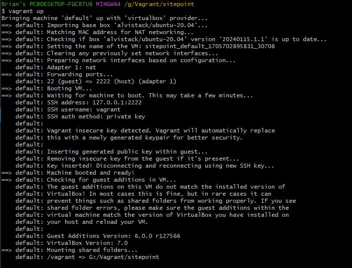
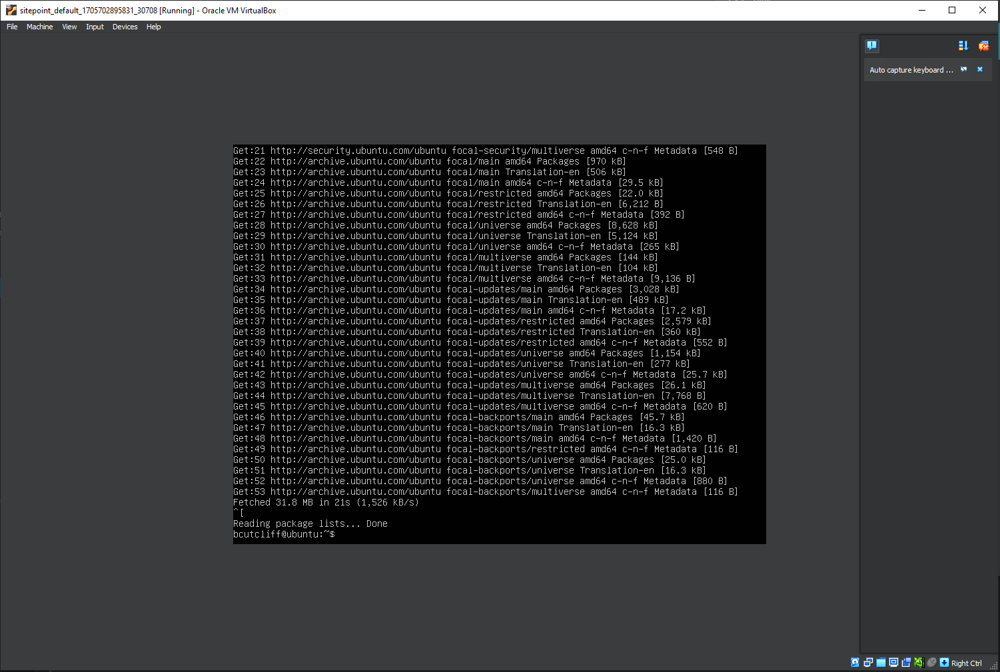
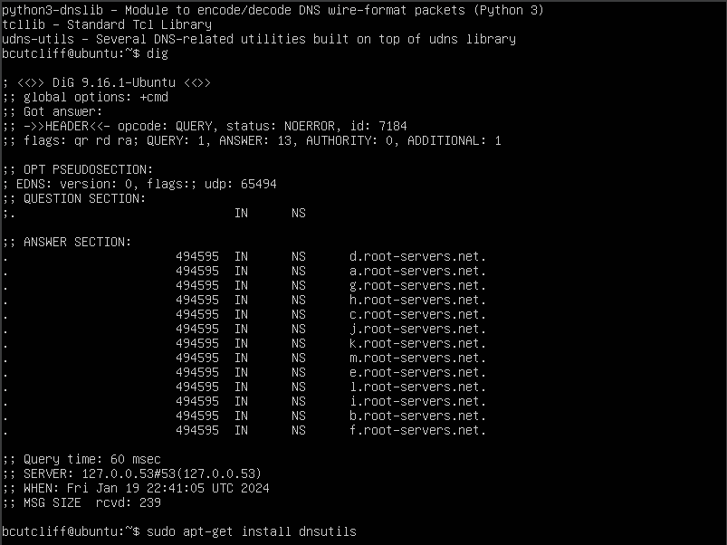

## Week 1 Lab Assignment. 

## Part 2a: Installing a local virtual machine

Vagrant commands:

**This creates a vagrant file in directory I created.**

    vagrant init alvistack/ubuntu-20.04

**This downloaded and launched my VM using virtualbox.**

    vagrant up

**Image below is of my git-bash using vagrant to bring up my ubuntu in virtualBox**

## Part 2b: Linux Operations exploring DNS and Dig.

I had to use the username and login as vagrant then create a username and password for myself, and then add my user to the sudoers group.  After that I installed the update using:

    sudo apt-get update

Once that was complete I had to install dig, which was done using the following command:

    sudo apt-get install dnsutils

Using the dig command to find the IP address of regis.edu: 

    bcutcliff@ubuntu:~$ dig regis.edu +short
    216.54.215.129

Using the dig command to find the IP address of programmingkitchen.com:

    bcutcliff@ubuntu:~$ dig programmingkitchen.com +short
    172.200.38.66

`dig programmingkitchen.com +short`

My FQDN (Fully Qualified Domain Name, didn't know that one!) was www.seriouseats.com, my favorite cooking site. Here is the command line:

    bcutcliff@ubuntu:~$ dig seriouseats.com +short
    151.101.130.137
    151.101.194.137
    151.101.2.137
    151.101.66.137
    bcutcliff@ubuntu:~$

## Part 3: Git Hub 

I first created a new project on my GitHub titled "MSES602" as instructed.  From there I also logged into my GitHub on MS Visual studio code.  With logging into and linking my GitHub with my VS Code I was able to see all my projects there.  Traditionally I have done the following:

**Git Clone via SSH keys:**

1). Generate keys on my Linux OS/VM and then I would then include that key in my GitHub account.

2). I would make a project structure on my Linux OS and then when I wanted to clone my repository I would perform the following command:
    
    git clone <SSH link>

**Git Clone via HTTP:**

This can also be performed by command line:
    
    git clone <HTTP link>

2) Use login and password to perform git clone.

3) With the clone being automated for GitHub integration into VS Studio Code I was mostly set.  I navigated to my project/repository for this course.  I created this README and then pushed to the GitHub repository. This is the command:

        git push --set-upstream origin week1

4) Once my local git instance and GitHub were in the same state I created a branch called "week1", and this is the command I used:

        git checkout -b week1

5) Checking status of local git repository to observe any changes:
        
        git status -v ( or -vv or no option)

